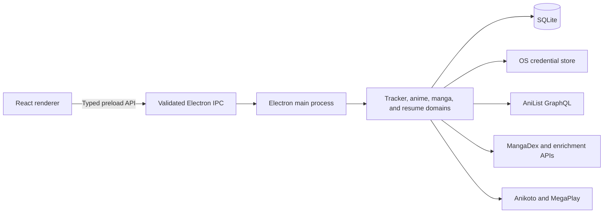

# AniStream

**Discover anime and manga, watch or read, and keep your progress in one desktop app.**

AniStream is an early-preview media app for anime and manga fans. Browse trending titles, search
both catalogs from one place, open episode and chapter lists, and continue from where you left off.
An AniList account is optional.


> **Current release:** v0.1.3 for Apple Silicon Macs running macOS 12 or newer, with an unsigned
> Windows x64 installer built by GitHub Actions. Android remains under development.

## Download AniStream for macOS

1. Open [AniStream Releases](https://github.com/Athen2045/AniStream/releases) and select v0.1.3.
2. Under **Assets**, download the macOS DMG: `AniStream-0.1.3-arm64.dmg`.
3. Open the DMG and drag **AniStream** into **Applications**.
4. Open AniStream from the Applications folder.

AniStream v0.1.3 is not signed or notarized with an Apple Developer ID. If macOS blocks the first
launch, Control-click AniStream in Applications, choose **Open**, then confirm **Open**. You only
need to do this once. Do not disable Gatekeeper globally.

### Start using the app

- Browse **Anime** and **Manga** without creating an account.
- Use the search bar to find a title, then open its episode or chapter list.
- AniStream stores playback and reading progress locally on your Mac.
- Open **Profile** if you want to connect AniList and add your lists, ratings, and tracker progress.

AniList connection is optional. Users sign in and approve AniStream in the AniList browser flow;
no Developer Settings client or secret is required. The rest of the app remains available while
signed out.

## Download AniStream for Windows

1. Open [AniStream Releases](https://github.com/Athen2045/AniStream/releases) and select v0.1.3.
2. Under **Assets**, download `AniStream Setup 0.1.3.exe`.
3. Run the installer and choose an installation folder.
4. Launch AniStream from the Start menu or desktop shortcut.

The Windows installer is currently unsigned, so SmartScreen may show a warning. Select **More
info**, confirm the unsigned release status, and choose **Run anyway** only when you downloaded
the installer from the project release page. Signing and SmartScreen reputation remain pending.

### What is included

- One search experience for anime and manga.
- Trending and latest-update discovery pages.
- Detailed title information from AniList and supplemental metadata providers.
- Episode browsing with sub/dub embedded anime playback.
- MangaDex chapter lists and a fullscreen vertical reader.
- Local episode, chapter, and scroll-position resume.
- Optional AniList profile, list, score, progress, and completion syncing.

> AniStream is an early personal project. Streaming and reading availability depends on external
> providers and can change without notice. Only access media you are legally permitted to use in
> your region.

---

# For developers

AniStream is a cross-platform Electron application built as a portfolio-scale full-stack desktop
system. It demonstrates secure process isolation, typed IPC, provider orchestration, local-first
persistence, OAuth lifecycle management, resilient network behavior, and media-focused React UI
engineering without introducing a separate cloud backend.

## Engineering scope

- **Desktop architecture:** Electron main, preload, and renderer processes with explicit ownership
  boundaries.
- **Type-safe integration:** strict TypeScript contracts shared across validated IPC channels.
- **Security:** `contextIsolation`, Electron sandboxing, disabled renderer Node integration,
  origin-validated IPC, runtime payload validation, denied child navigation, and encrypted local
  credential storage through Electron `safeStorage`.
- **Local persistence:** SQLite stores playback checkpoints, manga reading progress, and the cached
  AniList dashboard for one local user; provider adapters use bounded in-memory caches.
- **Network resilience:** request throttling, in-flight deduplication, TTL caches, abort signals,
  bounded retries, provider cooldowns, stale-response rejection, and degraded-mode orchestration.
- **Media UX:** code-split anime and manga experiences, fullscreen view transitions, reduced-motion
  support, keyboard navigation, paged discovery grids, viewport-lazy manga pages, and local resume.
- **Quality gates:** strict type checking, ESLint, Prettier, fixture-based Vitest coverage, preload
  packaging checks, OAuth contract checks, GitHub Actions, CodeQL, and dependency auditing.

## Architecture



The renderer owns presentation and transient interaction state. The trusted main process owns
credentials, persistence, provider traffic, throttling, caching, media-source resolution, and
filesystem access. The preload exposes a narrow serializable API rather than raw Electron access.

## Technology stack

| Layer            | Technology                               | Role                                                                                                 |
| ---------------- | ---------------------------------------- | ---------------------------------------------------------------------------------------------------- |
| Desktop runtime  | Electron 43                              | macOS windowing, lifecycle, custom OAuth protocol, secure IPC, and packaging                         |
| UI               | React 19, Framer Motion, Lucide          | catalog, profile, detail, player, reader, accessible transitions, and iconography                    |
| Language         | TypeScript 7                             | strict contracts across main, preload, shared, and renderer code                                     |
| Build            | electron-vite 5, Vite 7                  | development server and production bundles                                                            |
| Persistence      | SQLite with `better-sqlite3`             | local resume state, cached dashboard data, and bounded persistence                                   |
| Styling          | Plain CSS and design tokens              | responsive cinematic UI without a component-framework dependency                                     |
| Testing          | Vitest, ESLint, Prettier                 | fixtures, unit/regression checks, static analysis, and formatting                                    |
| Packaging and CI | electron-builder, GitHub Actions, CodeQL | Apple Silicon DMG and Windows x64 installer builds, release assets, verification, and security scans |

## Provider boundaries

| Provider                   | Responsibility                                                         | Failure behavior                                                 |
| -------------------------- | ---------------------------------------------------------------------- | ---------------------------------------------------------------- |
| AniList                    | Primary metadata, search, profile, lists, scores, and tracker progress | Signed-out discovery and local resume remain usable              |
| MangaDex                   | Exact-ID manga mapping, chapter feeds, MangaDex@Home page delivery     | Manga details degrade without breaking anime or profile features |
| Anikoto and MegaPlay       | Episode lookup and embedded sub/dub playback                           | Discovery and manga continue when playback is unavailable        |
| MangaBaka and MangaUpdates | Exact-ID supplemental manga metadata                                   | Enrichment disappears; MangaDex remains the reader source        |
| MyAnimeList                | Optional score cross-check and bounded catalog fallback                | AniList remains primary                                          |

Provider response types stay inside their adapters. Renderer-facing code receives normalized domain
contracts, and one provider failure does not invalidate unrelated data that loaded successfully.

## Local development setup

### Requirements

- Apple Silicon Mac for the macOS package, or Windows x64 for the Windows package
- macOS 12 or newer for the Mac app
- Node.js 22 or newer
- npm

### Install and run

```bash
git clone https://github.com/Athen2045/AniStream.git
cd AniStream
npm ci --legacy-peer-deps
cp .env.example .env
npm run dev
```

Most public discovery and reading features work with the defaults in `.env.example`. Optional
providers and account integrations can be configured separately.

### Configure AniList for development

AniStream uses AniList's implicit OAuth grant with the registered callback
`anistream://auth/anilist`. Users only sign in to AniList and approve AniStream in the browser;
they never need to create an AniList Developer application or provide a client secret. The access
token returned in the callback is encrypted with Electron `safeStorage` and stored only on this
device. The Windows installer registers `anistream://` and routes the callback back to the existing
AniStream instance.

### Environment variables

| Variable                                     | Purpose                                                   | Required     |
| -------------------------------------------- | --------------------------------------------------------- | ------------ |
| `MANGADEX_LANGUAGE`                          | Preferred MangaDex chapter language; defaults to `en`     | No           |
| `ANISTREAM_ANIKOTO_ENABLED`                  | Local kill switch for the Anikoto adapter                 | No           |
| `ANISTREAM_ANIKOTO_API_URL`                  | Override for a verified Anikoto-compatible HTTPS endpoint | No           |
| `ANISTREAM_MAL_CLIENT_ID`                    | MyAnimeList score and catalog fallback                    | No           |
| `ANISTREAM_MANGABAKA_TOKEN`                  | MangaBaka PAT for higher API limits                       | No           |
| `MANGADEX_CLIENT_ID` and related credentials | Reserved for planned opt-in MangaDex account sync         | Not used yet |
| `PARSE_API_KEY` and Parse adapter values     | Reserved placeholders; no active adapter consumes them    | Not used yet |

Keep secrets in the trusted process. Never expose them to renderer code or commit a populated
`.env` file. Packaged development configuration can be read from
`~/Library/Application Support/AniStream/.env`.

## Development commands

```bash
npm run dev                  # Run Electron with the development renderer
npm test                     # Run the Vitest suite
npm run typecheck            # Check main and renderer TypeScript projects
npm run lint                 # Run ESLint
npm run format:check         # Check Prettier formatting
npm run build                # Create production main, preload, and renderer bundles
npm run check:product-slice  # Verify cross-process product contracts
npm run check:anilist-oauth  # Verify the implicit OAuth implementation
npm run package:mac          # Build the unsigned Apple Silicon app and DMG
npm run package:win          # Build the unsigned Windows x64 NSIS installer
```

## Project structure

```text
AniStream/
├── assets/app-icon/          macOS application icon source
├── build/                    electron-builder resources
├── scripts/                  OAuth, packaging, and contract verification scripts
├── src/main/                 trusted process, providers, persistence, and IPC
│   ├── anilist/              OAuth, GraphQL client, normalization, queue, and session storage
│   └── domains/              tracker, anime, manga, and resume orchestration
├── src/preload/              narrow typed renderer bridge
├── src/renderer/             React interface and media experiences
├── src/shared/               serializable contracts and cross-process validation rules
├── test/                     fixtures and Vitest regression coverage
├── electron-builder.yml      Apple Silicon DMG configuration
└── electron.vite.config.ts   main, preload, and renderer build configuration
```

Local `API.md`, `AGENTS.md`, `CONTEXT.md`, `docs/research/`, `docs/superpowers/`, and `spec/` files
are development-agent working notes and are intentionally gitignored. `README.md` is the public
project entry point.

`electron-builder.yml` configures both the unsigned Apple Silicon DMG and the unsigned Windows x64
NSIS installer.

## Build and release v0.1.3

Build the unsigned DMG locally:

```bash
npm ci --legacy-peer-deps
npm run package:mac
```

Windows packaging can be prepared from a Windows checkout with Visual Studio C++ tools,
the Windows SDK, Node.js, and Git installed:

```bash
npm run package:win
```

The Windows output is `dist/AniStream Setup 0.1.3.exe`. The macOS output is
`dist/AniStream-0.1.3-arm64.dmg`. Both packaging workflows run for tags matching `v*.*.*` and
manual dispatch. Each workflow verifies the sandbox-safe CommonJS preload, uploads an artifact, and
attaches its package to the matching GitHub Release. The Windows workflow also verifies install,
launch, and uninstall in an isolated temporary profile. Both packages remain unsigned until a
signing provider is configured.

For a signed Windows build, provide the electron-builder signing variables through CI secrets
(`CSC_LINK` and `CSC_KEY_PASSWORD`) and remove `CSC_IDENTITY_AUTO_DISCOVERY=false` from the signed
release job. Do not commit certificates, passwords, or Azure Artifact Signing tokens.

```bash
git tag v0.1.3
git push origin v0.1.3
```

Tagging should happen only after the version bump and release changes are committed. Code signing
and notarization remain pending until a valid Developer ID Application certificate is available.

## Platform roadmap

- **macOS on Apple Silicon:** active and available as the v0.1.3 preview.
- **Windows:** x64 NSIS packaging, native SQLite rebuilds, secretless AniList OAuth, CI checks, and
  installer lifecycle validation are implemented; signing and SmartScreen reputation remain
  pending.
- **Android:** under development as a future companion application; no APK is published yet.
- **MangaDex account sync:** planned as an opt-in Keychain-backed integration. Public MangaDex
  reading remains independent.

## Bugs and development ideas

See [ISSUES.md](ISSUES.md) for bug-report details, current opportunities, and the contributor
checklist. Security-sensitive reports should not include credentials or private library data.

AniStream is an independent personal project and is not affiliated with AniList, MangaDex,
MyAnimeList, MangaBaka, MangaUpdates, Anikoto, or MegaPlay.
