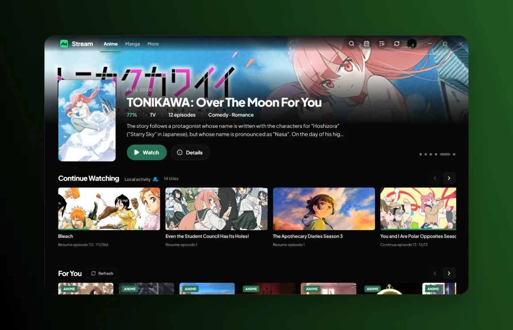
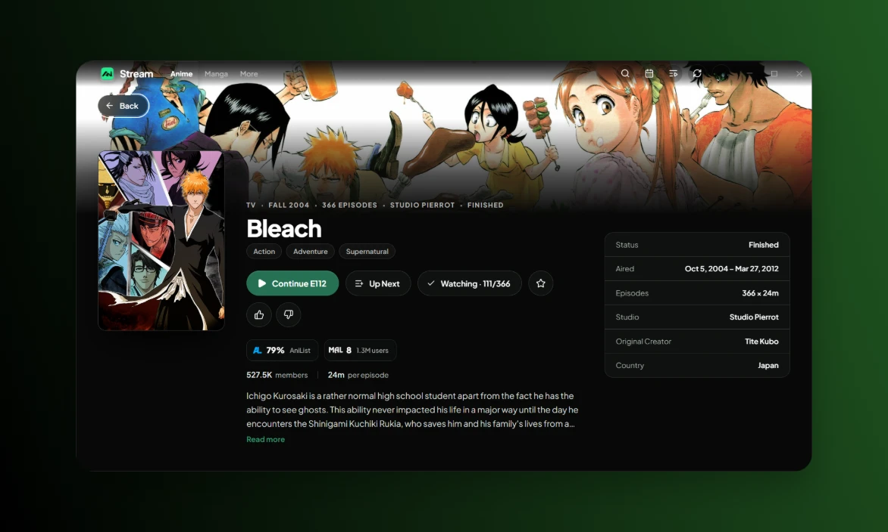
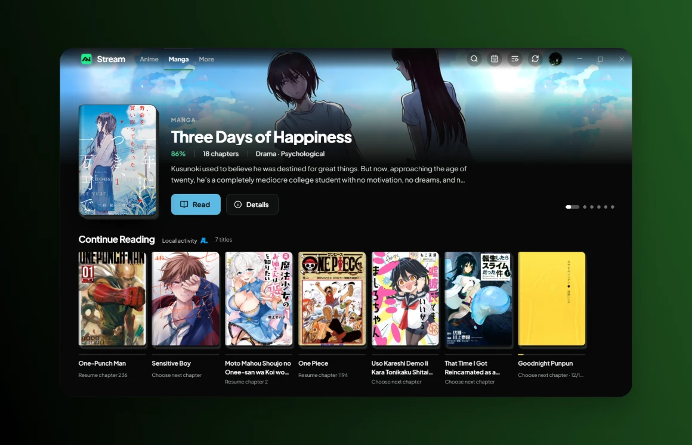

<h1 align="center"> Stream</h1>

<p align="center">

</p>

<p align="center">
  <a href="https://github.com/Athen2045/AniStream/releases/latest">Download</a> |
  <a href=".github/releases/v2.0.0.md">Release notes</a> |
  <a href="CHANGELOG.md">Changelog</a> |
  <a href="LEGAL.md">Copyright</a>
</p>

<div align="center">
  <a href="https://github.com/Athen2045/AniStream/releases/latest">
    
  </a>
  <a href="https://github.com/Athen2045/AniStream/releases">
    
  </a>
  <a href="https://github.com/Athen2045/AniStream/actions/workflows/ci.yml">
    
  </a>
  
  
</div>

<h5 align="center">
Leave a star if you like the project! ⭐️
</h5>

## About

AniStream is a **desktop app** for anime and manga. Browse what's trending, watch episodes, read
chapters, and pick up exactly where you left off. Your progress stays on your computer, and you can
connect AniList to sync your lists if you want to.

> [!IMPORTANT]
> AniStream does not host, store, or distribute any videos or manga. Streaming and reading
> availability depends on outside providers and can change without notice. Only watch or read media
> you are legally allowed to access where you live.

## Features

- **Watch**: Anime with sub or dub, continuing from the last episode you watched
- **Read**: Manga in a fullscreen reader that remembers your page
- **Discover**: Trending titles, latest updates, and full title pages with similar picks
- **For You**: Personal recommendations that run entirely on your device
  - Ranks titles by AniList recommendations from what you liked, how closely their tags, genres,
    and creators match your taste (rarer themes count more), and their popularity and rating
  - Recent history counts more than old history, and no single title can fill your rows
  - "Because you watched…" and "Because you like…" rows rotate through your whole history
  - One slot is saved for a well-rated pick outside your usual taste
  - Mark titles **Not interested** to teach it, or turn off **Learn from my activity** in Settings
- **Track**: Progress saved locally, with optional AniList sync
- **No ads, no telemetry**: Your data stays on your device, and you can back it up anytime

<p align="center">

</p>

<p align="center">

</p>

## Get started

Download the installer for your platform from the
[latest release](https://github.com/Athen2045/AniStream/releases/latest).

| Platform | File                        | Requires                           |
| -------- | --------------------------- | ---------------------------------- |
| Windows  | `AniStream Setup 2.0.0.exe` | Windows 10 or 11, x64              |
| macOS    | `AniStream-2.0.0-arm64.dmg` | macOS 12 or newer on Apple Silicon |

Both installers are unsigned. On Windows, select **More info → Run anyway** if SmartScreen warns
you. On macOS, open **System Settings → Privacy & Security** and choose **Open Anyway** after the
first launch. Each release includes a `SHA256SUMS.txt` file to verify your download.

**Updating from 0.1.x?** Install over your existing copy. Your progress, settings, and AniList
session are kept. AniStream checks GitHub for new versions when it starts and links you to the
release. It never updates itself or touches your data.

## Goal

This is a one-person project. It is built around a few rules: no ads, your data stays on your
device, nothing is sold or shared, and every integration is optional.

## Tech stack

- Desktop: [Electron](https://www.electronjs.org/)
- Frontend: [React](https://react.dev/), [TypeScript](https://www.typescriptlang.org/),
  [electron-vite](https://electron-vite.org/)
- Storage: [SQLite](https://www.sqlite.org/) via `better-sqlite3`

## Development and Build

You'll need [Node.js](https://nodejs.org/en/download) 22 or newer.

```bash
git clone https://github.com/Athen2045/AniStream.git
cd AniStream
npm ci
cp .env.example .env
npm run dev
```

Discovery, lists, and reading work with the defaults in `.env.example`. Playback endpoints are not
part of this repository; copy `providers.example.json` to `providers.local.json` to configure them.

See [CONTRIBUTING.md](.github/CONTRIBUTING.md) for checks, packaging, and the release workflow. Bug
reports and ideas are welcome through the
[issue forms](https://github.com/Athen2045/AniStream/issues/new/choose); report security problems
privately as described in [SECURITY.md](.github/SECURITY.md).

<br>

> [!NOTE]
> AniStream is an independent personal project and is not affiliated with AniList, MangaDex,
> MyAnimeList, or any playback provider. For copyright-related requests, see [LEGAL.md](LEGAL.md).
