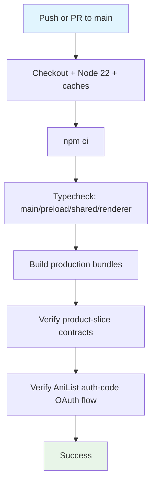

## Workflow Overview

**Purpose**: Prove that every push and pull request against `main` still type-checks, builds, and preserves the product-slice and AniList OAuth contracts that prior regressions have broken.
**Trigger Events**: Push to `main`; pull request targeting `main`.
**Target Environments**: Apple Silicon macOS build agent (matches the single supported runtime platform).

## Execution Flow Diagram



## Jobs & Dependencies

| Job Name | Purpose | Dependencies | Execution Context |
|----------|---------|--------------|-------------------|
| verify | Install, typecheck, build, and run source/bundle contract checks | None (single job) | macOS arm64 hosted runner |

## Requirements Matrix

### Functional Requirements
| ID | Requirement | Priority | Acceptance Criteria |
|----|-------------|----------|-------------------|
| REQ-001 | Dependencies install cleanly, including native module rebuild for Electron's ABI | High | `npm ci` exits 0 |
| REQ-002 | TypeScript strict-mode compiles with no errors across all three project seams | High | `npm run typecheck` exits 0 |
| REQ-003 | electron-vite produces main/preload/renderer production bundles | High | `npm run build` exits 0 |
| REQ-004 | Session-before-window ordering, browse/detail IPC, navbar UI, and provider contracts remain present in source | High | `npm run check:product-slice` exits 0 |
| REQ-005 | Built main bundle uses authorization-code OAuth (not implicit) and retains Keychain lookup/storage code paths | High | `npm run check:anilist-oauth` exits 0 |

### Security Requirements
| ID | Requirement | Implementation Constraint |
|----|-------------|---------------------------|
| SEC-001 | No workflow step interpolates untrusted event payload text (issue/PR body, commit message) into a shell command | All `run:` steps use fixed, repo-controlled commands only |
| SEC-002 | Workflow requests no elevated permissions | Default read-only `GITHUB_TOKEN` permissions (no explicit `permissions:` block needed) |

### Performance Requirements
| ID | Metric | Target | Measurement Method |
|----|-------|--------|-------------------|
| PERF-001 | End-to-end run time | Under 10 minutes on a warm cache | GitHub Actions run duration |
| PERF-002 | Electron/electron-builder download reuse | Cache hit on unchanged `package-lock.json` | `actions/cache` hit/miss in job log |

## Input/Output Contracts

### Inputs

```yaml
# Repository Triggers
paths: []            # not path-filtered; any change to main or a PR against it runs the full check
branches: [main]
```

### Outputs

```yaml
# Job Outputs
verify_status: pass|fail   # Description: single required status check consumed by branch protection
```

### Secrets & Variables

| Type | Name | Purpose | Scope |
|------|------|---------|-------|
| — | — | This workflow reads no secrets and no repository variables | — |

## Execution Constraints

### Runtime Constraints

- **Timeout**: 20 minutes per job (`timeout-minutes: 20`)
- **Concurrency**: One run per ref; a new push cancels the in-flight run for the same ref
- **Resource Limits**: Standard GitHub-hosted `macos-14` runner limits

### Environmental Constraints

- **Runner Requirements**: macOS arm64 (Apple Silicon), matching the app's only supported platform
- **Network Access**: Outbound only, to npm registry and Electron's binary mirror during `postinstall`
- **Permissions**: Default read-only `GITHUB_TOKEN`

## Error Handling Strategy

| Error Type | Response | Recovery Action |
|------------|----------|-----------------|
| Dependency install failure | Job fails at `npm ci` step | Reproduce locally with `npm ci`; check Electron download/network or native rebuild toolchain |
| Type error | Job fails at typecheck step | Fix reported TypeScript diagnostics; re-push |
| Build failure | Job fails at build step | Inspect electron-vite error output; re-push |
| Contract regression | Job fails at the relevant `check:*` script | Restore the missing fragment/ordering the script asserts, or update the script deliberately if the contract intentionally changed |

## Quality Gates

### Gate Definitions

| Gate | Criteria | Bypass Conditions |
|------|----------|-------------------|
| Typecheck | Zero TypeScript diagnostics | None |
| Build | electron-vite build completes | None |
| Contract checks | Both `check:*` scripts exit 0 | None — these encode previously shipped regressions and must not be bypassed |

## Monitoring & Observability

### Key Metrics

- **Success Rate**: Track via branch protection required-check history
- **Execution Time**: Track via Actions run duration trend
- **Resource Usage**: Not separately monitored (single short-lived job)

### Alerting

| Condition | Severity | Notification Target |
|-----------|----------|-------------------|
| Job failure on `main` | High | GitHub default commit-status/email notification to the maintainer |

## Integration Points

### External Systems

| System | Integration Type | Data Exchange | SLA Requirements |
|--------|------------------|---------------|------------------|
| npm registry | Package fetch | Dependency tarballs | Best-effort; no internal SLA |
| Electron binary mirror | Native binary fetch (via `postinstall`) | Prebuilt Electron zip | Best-effort; cached via `actions/cache` |

### Dependent Workflows

| Workflow | Relationship | Trigger Mechanism |
|----------|--------------|-------------------|
| Package macOS build | Downstream; only runs on tag/dispatch, independent of this workflow's outcome | Not chained — separate trigger |

## Compliance & Governance

### Audit Requirements

- **Execution Logs**: Retained per GitHub Actions default retention (90 days)
- **Approval Gates**: None; this is a required status check, not a deployment gate
- **Change Control**: Changes to this workflow file go through normal pull-request review

### Security Controls

- **Access Control**: Default `GITHUB_TOKEN` read-only permissions
- **Secret Management**: None used
- **Vulnerability Scanning**: Handled by the separate Dependency audit and CodeQL workflows

## Edge Cases & Exceptions

### Scenario Matrix

| Scenario | Expected Behavior | Validation Method |
|----------|-------------------|-------------------|
| `package-lock.json` unchanged between runs | Electron/electron-builder cache restores, install is fast | Compare run duration to prior run |
| A regression script is edited to assert a new contract | CI enforces the new contract on the next push | Review diff of `scripts/verify-*.mjs` in the PR |
| PR from a fork | Workflow still runs read-only checks; no secrets available regardless | No secrets are referenced, so behavior is unaffected |

## Validation Criteria

### Workflow Validation

- **VLD-001**: A push that introduces a TypeScript error fails the `verify` job at the typecheck step.
- **VLD-002**: A push that reintroduces implicit OAuth (`response_type=token`) fails `check:anilist-oauth`.

### Performance Benchmarks

- **PERF-001**: Cold-cache run completes in under 15 minutes.
- **PERF-002**: Warm-cache run completes in under 8 minutes.

## Change Management

### Update Process

1. **Specification Update**: Modify this document first.
2. **Review & Approval**: Self-reviewed pull request (single-maintainer project).
3. **Implementation**: Apply changes to `.github/workflows/ci.yml`.
4. **Testing**: Open a throwaway PR to confirm the updated workflow runs as expected.
5. **Deployment**: Merge to `main`.

### Version History

| Version | Date | Changes | Author |
|---------|------|---------|--------|
| 1.0 | 2026-07-27 | Initial specification | AniStream maintainer (with Claude Code) |

## Related Specifications

- [spec-process-cicd-package-mac.md](spec-process-cicd-package-mac.md)
- [spec-process-cicd-security-audit.md](spec-process-cicd-security-audit.md)
- [spec-process-cicd-codeql.md](spec-process-cicd-codeql.md)
