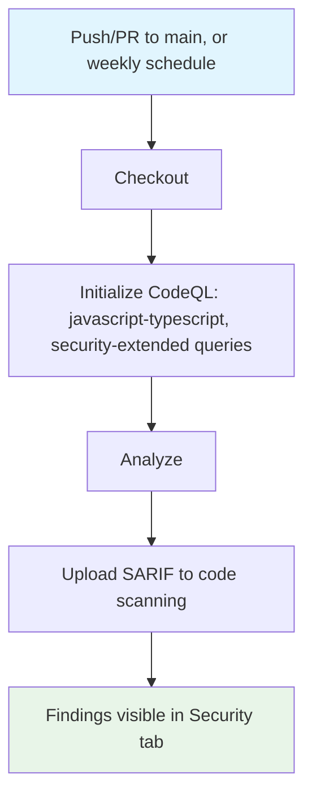

## Workflow Overview

**Purpose**: Statically analyze the TypeScript/JavaScript source for injection, unsafe IPC, and other security-relevant patterns — important given the app handles OAuth secrets, access tokens, and Electron IPC boundaries.
**Trigger Events**: Push to `main`; pull request targeting `main`; weekly schedule.
**Target Environments**: Ephemeral Linux runner (static analysis only; no Electron build required).

## Execution Flow Diagram



## Jobs & Dependencies

| Job Name | Purpose                                                                              | Dependencies      | Execution Context   |
| -------- | ------------------------------------------------------------------------------------ | ----------------- | ------------------- |
| analyze  | Initialize and run CodeQL against the JS/TS source, publish results to code scanning | None (single job) | Linux hosted runner |

## Requirements Matrix

### Functional Requirements

| ID      | Requirement                                                                                   | Priority | Acceptance Criteria                                                              |
| ------- | --------------------------------------------------------------------------------------------- | -------- | -------------------------------------------------------------------------------- |
| REQ-001 | Every push/PR to `main` is scanned with CodeQL's extended security query pack                 | High     | `analyze` job completes and uploads a SARIF result                               |
| REQ-002 | Findings surface in the repository's Security > Code scanning view                            | High     | `github/codeql-action/analyze` succeeds with `security-events: write` permission |
| REQ-003 | A weekly scan runs even with no code changes, to pick up newly published CodeQL query updates | Medium   | Scheduled trigger fires and completes independent of push/PR activity            |

### Security Requirements

| ID      | Requirement                                                  | Implementation Constraint                                                             |
| ------- | ------------------------------------------------------------ | ------------------------------------------------------------------------------------- |
| SEC-001 | Workflow requests only the permissions it needs              | `contents: read`, `security-events: write` — no write access to code or releases      |
| SEC-002 | Analysis runs against untrusted PR code without executing it | CodeQL analyzes source statically; no app build/run step is included in this workflow |

### Performance Requirements

| ID       | Metric   | Target           | Measurement Method          |
| -------- | -------- | ---------------- | --------------------------- |
| PERF-001 | Run time | Under 15 minutes | GitHub Actions run duration |

## Input/Output Contracts

### Inputs

```yaml
# Repository Triggers
branches: [main]
schedule: "30 4 * * 3" # weekly, Wednesday 04:30 UTC
languages: [javascript-typescript]
queries: [security-extended]
```

### Outputs

```yaml
# Job Outputs
sarif_report: file # Description: CodeQL findings, uploaded to GitHub code scanning
```

### Secrets & Variables

| Type  | Name                      | Purpose                               | Scope                               |
| ----- | ------------------------- | ------------------------------------- | ----------------------------------- |
| Token | `GITHUB_TOKEN` (implicit) | Upload SARIF results to code scanning | Workflow (`security-events: write`) |

## Execution Constraints

### Runtime Constraints

- **Timeout**: 15 minutes (`timeout-minutes: 15`)
- **Concurrency**: One analysis run per ref; a new push cancels the in-flight run for the same ref
- **Resource Limits**: Standard GitHub-hosted `ubuntu-latest` runner limits

### Environmental Constraints

- **Runner Requirements**: Any Linux runner; CodeQL for JS/TS does not require building or running Electron
- **Network Access**: Outbound to fetch CodeQL query packs and CLI
- **Permissions**: `contents: read`, `security-events: write`

## Error Handling Strategy

| Error Type                    | Response                                                        | Recovery Action                                                    |
| ----------------------------- | --------------------------------------------------------------- | ------------------------------------------------------------------ |
| CodeQL initialization failure | Job fails at `init` step                                        | Check CodeQL action version compatibility; re-run                  |
| Analysis timeout              | Job fails at `analyze` step                                     | Increase `timeout-minutes` if the codebase has grown significantly |
| SARIF upload failure          | Job fails at `analyze` step (upload is part of the same action) | Confirm `security-events: write` permission is still granted       |

## Quality Gates

### Gate Definitions

| Gate             | Criteria                                                                                       | Bypass Conditions                                           |
| ---------------- | ---------------------------------------------------------------------------------------------- | ----------------------------------------------------------- |
| Scan completion  | `analyze` step exits 0                                                                         | None                                                        |
| Finding severity | Not currently configured to block merges — findings are advisory, reviewed in the Security tab | Revisit once findings history establishes a stable baseline |

## Monitoring & Observability

### Key Metrics

- **Success Rate**: Track via Actions run history for this workflow
- **Execution Time**: Track via Actions run duration trend
- **Resource Usage**: Not applicable (no build artifact)

### Alerting

| Condition                 | Severity | Notification Target                                                   |
| ------------------------- | -------- | --------------------------------------------------------------------- |
| New high/critical finding | High     | GitHub code scanning alert, visible in the Security tab and PR checks |
| Workflow failure          | Medium   | GitHub default notification to the maintainer                         |

## Integration Points

### External Systems

| System               | Integration Type | Data Exchange            | SLA Requirements             |
| -------------------- | ---------------- | ------------------------ | ---------------------------- |
| GitHub code scanning | SARIF ingestion  | Static analysis findings | Best-effort; no internal SLA |

### Dependent Workflows

| Workflow | Relationship | Trigger Mechanism              |
| -------- | ------------ | ------------------------------ |
| CI       | Independent  | Not chained — separate trigger |

## Compliance & Governance

### Audit Requirements

- **Execution Logs**: Retained per GitHub Actions default retention (90 days)
- **Approval Gates**: None; findings are advisory, not merge-blocking, at this stage
- **Change Control**: Changes to this workflow file go through normal pull-request review

### Security Controls

- **Access Control**: `contents: read`, `security-events: write` only
- **Secret Management**: None used beyond the implicit `GITHUB_TOKEN`
- **Vulnerability Scanning**: This workflow covers source-level static analysis; the Dependency audit workflow covers third-party package vulnerabilities

## Edge Cases & Exceptions

### Scenario Matrix

| Scenario                        | Expected Behavior                                                   | Validation Method                                                          |
| ------------------------------- | ------------------------------------------------------------------- | -------------------------------------------------------------------------- |
| PR from a fork                  | Analysis still runs read-only; findings post to the PR's checks     | Confirm SARIF upload succeeds without write access to fork content         |
| No code changes in a given week | Scheduled run still executes, picking up updated CodeQL query packs | Compare scheduled run's finding count against the prior push-triggered run |

## Validation Criteria

### Workflow Validation

- **VLD-001**: A source change introducing an obvious injection pattern (e.g., unsanitized shell command construction) is flagged in the Security tab after the run.
- **VLD-002**: The scheduled Wednesday run completes even with zero commits that week.

### Performance Benchmarks

- **PERF-001**: Run completes in under 15 minutes for the current codebase size.

## Change Management

### Update Process

1. **Specification Update**: Modify this document first.
2. **Review & Approval**: Self-reviewed pull request (single-maintainer project).
3. **Implementation**: Apply changes to `.github/workflows/codeql.yml`.
4. **Testing**: Open a throwaway PR to confirm the updated workflow runs and uploads results.
5. **Deployment**: Merge to `main`.

### Version History

| Version | Date       | Changes               | Author                                  |
| ------- | ---------- | --------------------- | --------------------------------------- |
| 1.0     | 2026-07-27 | Initial specification | AniStream maintainer (with Claude Code) |

## Related Specifications

- [spec-process-cicd-ci.md](spec-process-cicd-ci.md)
- [spec-process-cicd-security-audit.md](spec-process-cicd-security-audit.md)
