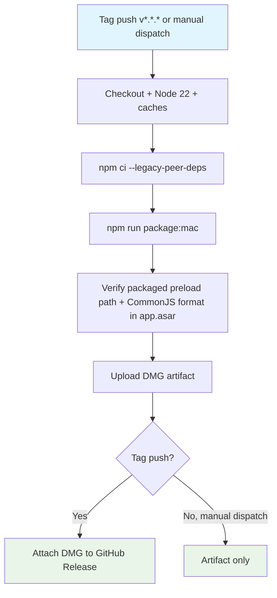

## Workflow Overview

**Purpose**: Produce a verified, unsigned Apple Silicon `.dmg` and guard against the historical packaged-blank-screen regression (ESM preload rejected by the sandboxed renderer).
**Trigger Events**: Push of a `v*.*.*` tag; manual dispatch.
**Target Environments**: Apple Silicon macOS build agent, producing an artifact for the app's only supported platform.

## Execution Flow Diagram



## Jobs & Dependencies

| Job Name | Purpose                                                                      | Dependencies      | Execution Context         |
| -------- | ---------------------------------------------------------------------------- | ----------------- | ------------------------- |
| package  | Build the unsigned arm64 DMG, verify the packaged ASAR, publish the artifact | None (single job) | macOS arm64 hosted runner |

## Requirements Matrix

### Functional Requirements

| ID      | Requirement                                                                              | Priority | Acceptance Criteria                                                                     |
| ------- | ---------------------------------------------------------------------------------------- | -------- | --------------------------------------------------------------------------------------- |
| REQ-001 | electron-builder produces an arm64-only `.dmg` under `dist/`                             | High     | `npm run package:mac` exits 0 and `dist/*.dmg` exists                                   |
| REQ-002 | The packaged main process requests a preload path that actually exists inside `app.asar` | High     | `check:packaged-preload` locates the requested path in the ASAR listing                 |
| REQ-003 | The packaged preload is emitted as CommonJS (`.cjs`), never ESM `import` syntax          | High     | `check:packaged-preload` rejects any `import` statement in the extracted preload bundle |
| REQ-004 | The DMG is retrievable after the run without needing local rebuild                       | Medium   | Workflow artifact `AniStream-mac-arm64-dmg` is attached to the run                      |
| REQ-005 | Tagged releases publish the DMG to the corresponding GitHub Release                      | Medium   | `softprops/action-gh-release` attaches `dist/*.dmg` when the ref is a `v*` tag          |

### Security Requirements

| ID      | Requirement                                                                     | Implementation Constraint                                                                                     |
| ------- | ------------------------------------------------------------------------------- | ------------------------------------------------------------------------------------------------------------- |
| SEC-001 | Packaging never attempts local code-signing on the runner                       | `CSC_IDENTITY_AUTO_DISCOVERY=false` is set so electron-builder does not search the runner's keychain          |
| SEC-002 | The produced DMG is explicitly unsigned and this is not silently hidden         | README/CONTEXT.md continue to state the package is unsigned; no signing secret is introduced by this workflow |
| SEC-003 | Release publishing uses the default `GITHUB_TOKEN`, not a personal access token | `permissions: contents: write` at workflow level; no additional secret configured                             |

### Performance Requirements

| ID       | Metric              | Target                           | Measurement Method          |
| -------- | ------------------- | -------------------------------- | --------------------------- |
| PERF-001 | End-to-end run time | Under 25 minutes on a warm cache | GitHub Actions run duration |

## Input/Output Contracts

### Inputs

```yaml
# Repository Triggers
tags: ["v*.*.*"]
workflow_dispatch: {} # no inputs required
```

### Outputs

```yaml
# Job Outputs
dmg_artifact: file # Description: unsigned arm64 .dmg, retained 14 days
github_release_asset: file # Description: same .dmg attached to the tag's GitHub Release, tag-triggered runs only
```

### Secrets & Variables

| Type     | Name                          | Purpose                                       | Scope                        |
| -------- | ----------------------------- | --------------------------------------------- | ---------------------------- |
| Token    | `GITHUB_TOKEN` (implicit)     | Publish the DMG to a GitHub Release           | Workflow (`contents: write`) |
| Variable | `CSC_IDENTITY_AUTO_DISCOVERY` | Disable local code-signing identity discovery | Step-level env               |

## Execution Constraints

### Runtime Constraints

- **Timeout**: 30 minutes (`timeout-minutes: 30`)
- **Concurrency**: One packaging run per ref at a time; new runs do not cancel an in-progress release build (`cancel-in-progress: false`)
- **Resource Limits**: Standard GitHub-hosted `macos-14` runner limits; DMG output is ~130 MB, well under artifact size limits

### Environmental Constraints

- **Runner Requirements**: macOS arm64 (Apple Silicon) — required for both the native `better-sqlite3` rebuild and a correct arm64 target build
- **Network Access**: Outbound to npm registry and Electron's binary mirror
- **Permissions**: `contents: write` (required only to attach release assets)

## Error Handling Strategy

| Error Type                        | Response                                                                              | Recovery Action                                                                                                |
| --------------------------------- | ------------------------------------------------------------------------------------- | -------------------------------------------------------------------------------------------------------------- |
| Packaging failure                 | Job fails at `package:mac` step                                                       | Inspect electron-builder log; reproduce locally with `npm run package:mac`                                     |
| Missing/incorrect preload in ASAR | Job fails at the verification step with the specific missing path or format violation | Fix `electron.vite.config.ts` preload output format or the `BrowserWindow` preload path in `src/main/index.ts` |
| No DMG produced                   | Upload step fails fast (`if-no-files-found: error`)                                   | Treat as a packaging failure; do not allow a silent empty release                                              |

## Quality Gates

### Gate Definitions

| Gate                          | Criteria                                                     | Bypass Conditions                                                   |
| ----------------------------- | ------------------------------------------------------------ | ------------------------------------------------------------------- |
| Packaging                     | `electron-builder --mac --arm64` exits 0                     | None                                                                |
| Packaged-preload verification | `check:packaged-preload` exits 0 against the real `app.asar` | None — this is the exact regression this workflow exists to prevent |

## Monitoring & Observability

### Key Metrics

- **Success Rate**: Track via Actions run history for this workflow
- **Execution Time**: Track via Actions run duration trend
- **Resource Usage**: DMG artifact size trend (flag unexpected growth)

### Alerting

| Condition                 | Severity | Notification Target                                                                                   |
| ------------------------- | -------- | ----------------------------------------------------------------------------------------------------- |
| Tag-triggered run failure | High     | GitHub default notification to the maintainer; a tagged release with no attached DMG is a visible gap |

## Integration Points

### External Systems

| System                         | Integration Type         | Data Exchange                     | SLA Requirements             |
| ------------------------------ | ------------------------ | --------------------------------- | ---------------------------- |
| GitHub Releases                | Asset attachment         | Binary `.dmg` file                | Best-effort; no internal SLA |
| npm registry / Electron mirror | Package and binary fetch | Dependency tarballs, Electron zip | Best-effort                  |

### Dependent Workflows

| Workflow | Relationship                               | Trigger Mechanism              |
| -------- | ------------------------------------------ | ------------------------------ |
| CI       | Independent; not a prerequisite gate today | Not chained — separate trigger |

## Compliance & Governance

### Audit Requirements

- **Execution Logs**: Retained per GitHub Actions default retention (90 days)
- **Approval Gates**: None; single-maintainer project, no environment protection rules configured
- **Change Control**: Changes to this workflow file go through normal pull-request review

### Security Controls

- **Access Control**: `contents: write` only; no other elevated permissions
- **Secret Management**: No signing secrets exist or are referenced (package remains unsigned until a Developer ID certificate is provisioned — tracked in CONTEXT.md)
- **Vulnerability Scanning**: Handled by the separate Dependency audit workflow, not duplicated here

## Edge Cases & Exceptions

### Scenario Matrix

| Scenario                                                      | Expected Behavior                                                                                                              | Validation Method                                                     |
| ------------------------------------------------------------- | ------------------------------------------------------------------------------------------------------------------------------ | --------------------------------------------------------------------- |
| Manual dispatch on a non-tag ref                              | DMG is built and uploaded as a workflow artifact only; no release step runs                                                    | `if: startsWith(github.ref, 'refs/tags/v')` guards the release step   |
| Tag pushed without a corresponding GitHub Release pre-created | `softprops/action-gh-release` creates the release if absent                                                                    | Confirm release appears with the DMG attached and generated notes     |
| A future Developer ID certificate is added                    | This workflow must be revisited to import the certificate/keychain and remove the `CSC_IDENTITY_AUTO_DISCOVERY=false` override | Update this spec's Security Requirements before changing the workflow |

## Validation Criteria

### Workflow Validation

- **VLD-001**: Pushing a `v0.2.0` tag produces a GitHub Release with an attached `.dmg`.
- **VLD-002**: A build that reintroduces an ESM preload bundle fails the verification step before any artifact is uploaded.

### Performance Benchmarks

- **PERF-001**: Cold-cache run completes in under 30 minutes.

## Change Management

### Update Process

1. **Specification Update**: Modify this document first.
2. **Review & Approval**: Self-reviewed pull request (single-maintainer project).
3. **Implementation**: Apply changes to `.github/workflows/package-mac.yml`.
4. **Testing**: Run via `workflow_dispatch` before relying on a tag push.
5. **Deployment**: Merge to `main`; tag when a real release is ready.

### Version History

| Version | Date       | Changes                                                                                                                  | Author                                  |
| ------- | ---------- | ------------------------------------------------------------------------------------------------------------------------ | --------------------------------------- |
| 1.0     | 2026-07-27 | Initial specification                                                                                                    | AniStream maintainer (with Claude Code) |
| 1.1     | 2026-07-27 | Switched install to `npm ci --legacy-peer-deps` (eslint-plugin-react/ESLint 10 peer-range lag; `npm ci` alone now fails) | AniStream maintainer (with Claude Code) |

## Related Specifications

- [spec-process-cicd-ci.md](spec-process-cicd-ci.md)
- [spec-process-cicd-security-audit.md](spec-process-cicd-security-audit.md)
