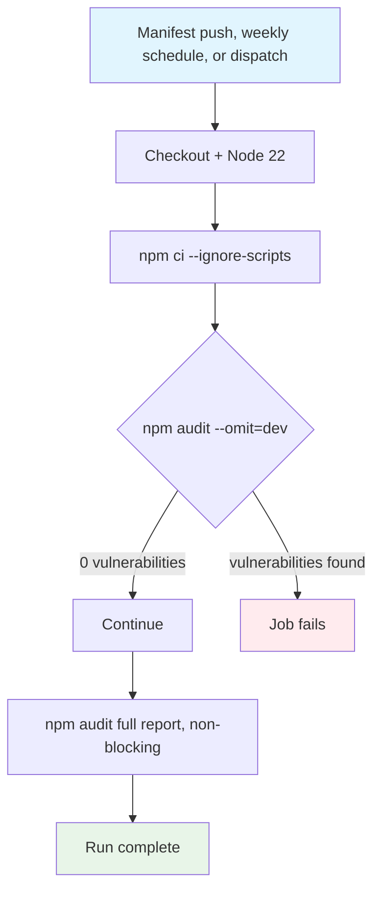

## Workflow Overview

**Purpose**: Continuously distinguish runtime-dependency vulnerabilities (which must block) from development/tooling-only advisories (which are tracked as accepted debt), matching the distinction already recorded in `CONTEXT.md`.
**Trigger Events**: Push to `main` touching `package.json`/`package-lock.json`; weekly schedule; manual dispatch.
**Target Environments**: Ephemeral macOS build agent (no artifact produced; audit-only).

## Execution Flow Diagram



## Jobs & Dependencies

| Job Name | Purpose | Dependencies | Execution Context |
|----------|---------|--------------|-------------------|
| audit | Install without lifecycle scripts, block on runtime vulnerabilities, report the full advisory tree | None (single job) | macOS arm64 hosted runner |

## Requirements Matrix

### Functional Requirements
| ID | Requirement | Priority | Acceptance Criteria |
|----|-------------|----------|-------------------|
| REQ-001 | Runtime (production) dependency tree has zero known vulnerabilities | High | `npm audit --omit=dev` exits 0 |
| REQ-002 | Full advisory tree (including dev/tooling dependencies) is visible in every run regardless of the blocking result | Medium | `npm audit` output is always printed (`if: always()`), never fails the job |
| REQ-003 | Install does not trigger Electron download/native rebuild for an audit-only run | Medium | `npm ci --ignore-scripts` is used instead of plain `npm ci` |

### Security Requirements
| ID | Requirement | Implementation Constraint |
|----|-------------|---------------------------|
| SEC-001 | A newly introduced runtime vulnerability blocks merges to `main` | `npm audit --omit=dev` step has no `continue-on-error` |
| SEC-002 | Known dev-only advisories (electron-builder's `glob`/`rimraf`/`temp` chain) do not create alert fatigue by failing every run | Full-tree audit step is explicitly non-blocking (`|| true`) |

### Performance Requirements
| ID | Metric | Target | Measurement Method |
|----|-------|--------|-------------------|
| PERF-001 | Run time | Under 5 minutes | GitHub Actions run duration |

## Input/Output Contracts

### Inputs

```yaml
# Repository Triggers
paths: ["package.json", "package-lock.json"]
branches: [main]
schedule: "0 6 * * 1"   # weekly, Monday 06:00 UTC
```

### Outputs

```yaml
# Job Outputs
runtime_audit_status: pass|fail   # Description: required status check
full_audit_report: log            # Description: informational advisory listing in job log
```

### Secrets & Variables

| Type | Name | Purpose | Scope |
|------|------|---------|-------|
| — | — | This workflow reads no secrets and no repository variables | — |

## Execution Constraints

### Runtime Constraints

- **Timeout**: 10 minutes (`timeout-minutes: 10`)
- **Concurrency**: No explicit concurrency group; overlapping scheduled and push-triggered runs are acceptable since the job is read-only
- **Resource Limits**: Standard GitHub-hosted `macos-14` runner limits

### Environmental Constraints

- **Runner Requirements**: Any Node 22 runner would satisfy this workflow; macOS is used only for consistency with the rest of the project's CI
- **Network Access**: Outbound to npm registry only (no Electron download, since `--ignore-scripts` skips `postinstall`)
- **Permissions**: Default read-only `GITHUB_TOKEN`

## Error Handling Strategy

| Error Type | Response | Recovery Action |
|------------|----------|-----------------|
| New runtime vulnerability | Job fails at the blocking audit step | Update or patch the offending runtime dependency; re-run |
| New dev-only vulnerability | Job still passes; visible in the full report step | Triage during the "resolve dev-audit advisories" priority item; not an emergency |
| npm registry outage | Install step fails | Re-run once the registry recovers; not a code issue |

## Quality Gates

### Gate Definitions

| Gate | Criteria | Bypass Conditions |
|------|----------|-------------------|
| Runtime vulnerability gate | `npm audit --omit=dev` reports zero vulnerabilities | None |
| Dev-dependency advisory visibility | Full audit output present in logs | Always runs; never gates merge |

## Monitoring & Observability

### Key Metrics

- **Success Rate**: Track via Actions run history for this workflow
- **Execution Time**: Track via Actions run duration trend
- **Resource Usage**: Not applicable (no build artifact)

### Alerting

| Condition | Severity | Notification Target |
|-----------|----------|-------------------|
| Runtime audit gate fails | High | GitHub default notification to the maintainer |
| Full audit advisory count changes materially week over week | Low | Reviewed manually when scanning weekly scheduled run logs |

## Integration Points

### External Systems

| System | Integration Type | Data Exchange | SLA Requirements |
|--------|------------------|---------------|------------------|
| npm registry / GitHub Advisory Database | Vulnerability data lookup | Advisory metadata via `npm audit` | Best-effort; no internal SLA |

### Dependent Workflows

| Workflow | Relationship | Trigger Mechanism |
|----------|--------------|-------------------|
| CI | Independent | Not chained — separate trigger |

## Compliance & Governance

### Audit Requirements

- **Execution Logs**: Retained per GitHub Actions default retention (90 days)
- **Approval Gates**: None
- **Change Control**: Changes to this workflow file go through normal pull-request review

### Security Controls

- **Access Control**: Default read-only `GITHUB_TOKEN`
- **Secret Management**: None used
- **Vulnerability Scanning**: This workflow *is* the dependency vulnerability scan; CodeQL covers source-level static analysis separately

## Edge Cases & Exceptions

### Scenario Matrix

| Scenario | Expected Behavior | Validation Method |
|----------|-------------------|-------------------|
| `electron-builder` ships a fixed major version resolving the known `glob`/`rimraf` chain | Full audit report shrinks; no workflow change required | Compare weekly report output before/after a dependency bump |
| A PR from a fork modifies `package.json` | Workflow runs read-only checks only; no secrets involved | No secrets are referenced, so behavior is unaffected |

## Validation Criteria

### Workflow Validation

- **VLD-001**: Introducing a runtime dependency with a known critical CVE fails the job.
- **VLD-002**: The existing 16 dev-only advisories do not fail the job today.

### Performance Benchmarks

- **PERF-001**: Run completes in under 5 minutes.

## Change Management

### Update Process

1. **Specification Update**: Modify this document first.
2. **Review & Approval**: Self-reviewed pull request (single-maintainer project).
3. **Implementation**: Apply changes to `.github/workflows/security-audit.yml`.
4. **Testing**: Trigger via `workflow_dispatch` to confirm behavior before relying on the schedule.
5. **Deployment**: Merge to `main`.

### Version History

| Version | Date | Changes | Author |
|---------|------|---------|--------|
| 1.0 | 2026-07-27 | Initial specification | AniStream maintainer (with Claude Code) |

## Related Specifications

- [spec-process-cicd-ci.md](spec-process-cicd-ci.md)
- [spec-process-cicd-codeql.md](spec-process-cicd-codeql.md)
